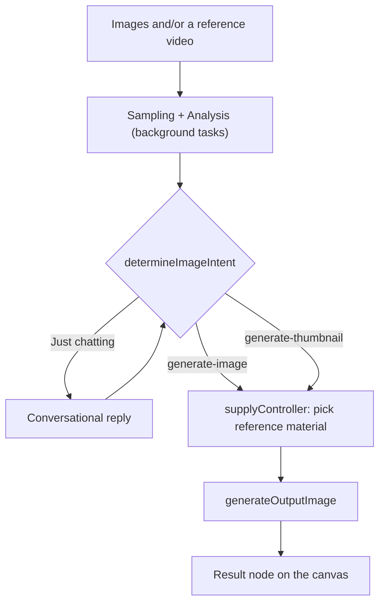

# 🧠 Technical Architecture

The technical heart of the **VGTU Video Summarization** project. This document
explains how the application turns raw footage and images into finished work.
It is written for students, instructors, and developers.

---

## 🌟 Core Concepts

The app splits work by **expected outcome**, not by what you upload:

| Outcome | Surface | Why |
|---|---|---|
| **Images** (stills, thumbnails, covers) | the **AI node graph** | branching exploration of discrete artifacts — generate several, compare, branch from the good one |
| **Video / audio** | the **timeline editor** | continuous media arranged in time, with frame-level control |

That is the single most important thing to understand about the codebase. There
used to be a second, older AI pipeline that produced *video* in the graph; it
rendered a finished file you could not adjust. It was retired in favour of the
editor, whose AI produces an **editable timeline** instead — same idea, better
output, and one implementation rather than two.

### 🧩 The Three Pillars
1.  **Vision & Sound (The Input):** audio and frames are extracted so the AI can "see" the material.
2.  **The Brain (Gemini AI):** Gemini models read the transcript and visual descriptions and decide what matters.
3.  **The Engine (FFmpeg & PySceneDetect):** the heavy lifting — cutting, merging, and detecting natural scene breaks.

---

## 🏗 Two workflows

### A. The node graph — image output

A reference video is sampled into ~8 stills (`startReferenceFrameExtraction`)
which join the user's own images in one pool. `generateOutputImage` serves both
flavours, picking its model slot, system instruction and `resultType` from the
intent — that is how "make a thumbnail from my video" works.

### B. The timeline editor — video output

Entered from Home's **Video** purpose, or from a blank timeline project. Media is
imported per asset and preprocessed independently (`src/main/editor/preprocess.ts`:
proxy → audio → transcript → scenes → thumbnails, every step skip-if-exists).
The AI path is `src/main/editor/prompt.ts`: one Gemini call per turn producing
**ops** (`src/main/editor/ops.ts`) which map to a `TimelineDiff` the renderer
applies. Output length comes from the user's request — personas describe style
only. Each turn becomes a branchable revision.

---

## 🚦 Reference: media pre-processing

The phases below are shared: `src/main/pipeline/phases/extraction.ts` still owns
audio extraction, transcription and scene description, and the **editor** calls
them per asset.

## 🚦 Phase 1: Pre-Processing (Preparation)
Before the AI can "watch" the video, we need to convert it into formats it can understand.

**Key File:** `src/main/pipeline/phases/extraction.ts`

1.  **Low-Res Proxy:** High-quality 4K video is too "heavy" for fast AI analysis. We create a 480p "proxy" version using **FFmpeg**.
2.  **Audio Extraction:** We pull the audio (MP3) because it's much faster for the AI to "listen" to a transcript than to process raw video pixels for every second.
3.  **Raw Transcript:** We use **Gemini 2.5** to generate an initial timestamped script of everything being said.

---

## 💎 Phase 3: Context Enrichment (Giving the AI "Eyes")
This is the most critical step. We give the AI a rich "cheat sheet" of what happens in the video.

**Key File:** `src/main/pipeline/phases/extraction.ts`

1.  **Transcript Correction:** Clean up "ums," "ahs," and technical terms in the raw transcript.
2.  **Scene Detection:** Using **PySceneDetect**, we find the exact moments where the camera cuts. This prevents the AI from cutting in the middle of a person's sentence or a visual action.
3.  **Visual Descriptions:** 
    *   We take a "screenshot" (snapshot) of every scene.
    *   **Gemini Flash Lite** writes a short description for each (e.g., *"A student presenting a slide about neural networks"*).
    *   The result is a **Master Timeline** that combines Text + Time + Visuals.

---

## 🎓 Instructor & Student FAQ

### Why use a proxy video?
Processing a 1GB 4K file directly for AI descriptions would be slow and expensive. A 480p proxy looks the same to the AI but processes in seconds.

### How does it handle "Hallucinations"?
The AI never touches media directly. It emits **ops** (JSON) which are validated
against real clip indices and real source durations before anything is placed —
out-of-range picks are clamped or dropped and reported on the result card.

### What happens if I edit an existing cut?
The AI is given the current timeline as context and edits it in place, like a
human editor changing only the clips you pointed at. Every turn becomes a
revision you can switch back to or branch from.

### How does the AI know how long the output should be?
From your request, and only from your request. Personas describe a *style*, not
a length. The model states the runtime it inferred, and the result card reports
what actually came out so you can see whether it read you correctly.
