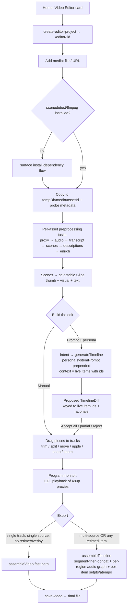

# FrameFlow — Timeline Video Editor PRD

FrameFlow today edits video through a single surface: an AI-driven node-graph "chat editor" where the user talks to Gemini, the model writes a timeline blueprint, and FFmpeg assembles a single-source cut. This PRD specifies a **second, coexisting surface** — a traditional CapCut/Premiere/DaVinci-style **timeline video editor** with a media browser, a program monitor, a multi-track timeline, direct manual editing, and a prompt box driven by swappable AI **editor personas**. It reuses FrameFlow's existing scene-detection, per-scene visual-description enrichment, background-task, `media://` playback, and thread-persistence machinery, while introducing a per-media preprocessing model, a timeline document, a persona library, and — the single largest new engineering lift — a multi-source/multi-track FFmpeg render engine that the current single-source `assembleVideo` cannot provide.

| | |
|---|---|
| **Status** | v1 shipped & verified (M0–M4) + revisions rework — on branch `feat/video-editor-m0-m1` |
| **Owner** | navidshad72@gmail.com |
| **Date** | 2026-07-18 (status updated as of implementation) |
| **App** | FrameFlow (Electron + Vue 3 + Vite, TypeScript) |
| **Feature** | Traditional timeline video editor (new surface, alongside the AI graph editor) |

---

## 0. Implementation Status

v1 was delivered in five milestones and all 8 requested features are live and user-verified. One post-v1 rework replaced the AI review flow (§5.7) with a branchable **revision tree**.

**Shipped (commits on `feat/video-editor-m0-m1`):**

| Milestone | Commit | What landed |
|---|---|---|
| M0+M1 | `b9fa93f` | Editor route/shell, media import (local + URL), per-asset preprocessing, scene-split into selectable pieces |
| M2 | `4a499e6` | Multi-track timeline (drag/trim/split/ripple/retime/snap/zoom/markers), EDL preview, filmstrip⇄context toggle, sidecar undo/redo, keyboard map |
| M3 | `f11e400` | AI prompt bar, 9 personas (long-form + summarize) + user personas, `EditorOps`→`TimelineDiff`, full context windowing |
| M4 | `5dfca7b` | Export: `assembleVideo` fast path + `assembleTimeline` segment-then-concat (retime, gaps, mutes, source-derived normalization) |
| Revisions | `68225ae` | **Replaces §5.7's accept/reject flow** — AI results apply immediately as branchable revisions (list + Vue Flow graph), manual checkpoints, full-snapshot sidecar |

**Not yet built — was in v1 scope, deferred during implementation:**
- **Silence/dead-air finder** (§5.6) — the assistive `silencedetect` review pass.
- **Dense filmstrip** (§5.5) — frames-preview currently shows one scene thumbnail per clip, not a batched multi-frame strip.
- **Detector sensitivity slider + merge/split pieces** (§5.2) — the `threshold` backend param exists; the UI does not.
- **Long-timeline navigation** (§5.3) — markers/chapter jumps exist; the always-visible **minimap/overview strip** and chapter **jump list** do not.
- **Per-asset transcript** (§5.2) — only scene *descriptions* are wired per-asset, so `clip.text` is never populated (AI context is visual-only).
- **Audio-kind assets** (§5.1/§5.4) — `MediaAsset.kind` is always `'video'`; the A1 lane can't yet receive imported audio, so audio-track preview/export mixing stays moot.
- **`prefers-reduced-motion`** gating (§5.11).

**Deferred by design (v2 / M5 non-goals, never promised for v1):** overlay/text authoring, effects & transitions engine, persona feature-sets (feature 8's full form — `featureSets` stub + registries in place), true multi-track compositing / PiP / simultaneous `amix` (region model is amix-ready), pro trims (roll/slip/slide/JKL, 3-point, nested sequences), keyframed speed ramps, word-level filler removal, a first-class `Chapter[]` model (Open Q12, recommended for v1.1).

---

## 1. Overview & Motivation

**What this is.** A new, full-bleed editor page (route `/editor/:id`) reachable from a "Video Editor" tile on the Home grid. It presents the layout professionals already know — a media/browser panel on the left, a large preview/program monitor in the center, an inspector on the right, and a multi-track timeline across the bottom — plus a docked prompt bar carrying a selectable AI persona. The user imports one or more videos, FrameFlow breaks each into selectable scene "pieces," the user drags pieces onto tracks or asks a persona to build/refine the edit by prompt, and finally exports a rendered file.

**It is length-agnostic.** This editor is **not** a summarizer. It targets full-length editorial work as much as short cuts: a 3-minute highlight *and* a 90-minute podcast, a vlog, a webinar, or a lecture kept at (or near) full length. A summary is just one possible output; the more common long-form goals are *cleaning* (remove filler/silence/dead air), *retiming* (speed a section up or slow it down), *reordering*, *chaptering*, and *trimming* — all without necessarily shortening the whole piece. Everything below (scene splitting, personas, budgets, AI context) is designed so a multi-hour timeline works, not only a short one (see the scalability treatment in §8).

**Why add it alongside the graph editor.** The existing graph editor (`src/renderer/src/pages/GraphChatPage.vue`) is outcome-oriented: you describe what you want and Gemini decides the whole cut. It is excellent for "summarize this lecture to 3 minutes," but it offers **no direct manipulation** — no dragging a clip, trimming a frame, muting a track, or placing two sources side by side. Real editing work needs a spatial, manual surface where time runs left→right and parallel content stacks as tracks. Rather than bolt manual controls onto the node graph (Vue Flow is the wrong interaction model for a 1-D timeline — see §7), we add a purpose-built editor that treats the timeline as a shared document both the human and the AI mutate.

**Who it is for.**
- **Long-form editors** — podcasters, vloggers, course/webinar creators, streamers cutting VODs — who keep most of the runtime and want to *tighten* it: remove filler and silence, retime slow stretches, reorder segments, add chapters. This is the primary audience, and the personas and budgets below are shaped for it.
- **Summarization users** who like FrameFlow's AI cuts but want to hand-tweak the result (nudge a boundary, drop one more scene, reorder).
- **Prosumer editors** who expect a familiar NLE layout and manual tools, but want an AI co-editor on tap.
- **Semantic editors** — FrameFlow's differentiator: every selectable piece already carries a one-line **visual description** (`EnrichedTimelineSegment.visual`), so users can see and reason about clips by meaning, not just thumbnails — which matters most on a long timeline where thumbnails alone are hard to scan.

The two paradigms stay cleanly separated by a single `Thread.type` discriminator and separate routes; they share persistence, preprocessing, background tasks, and the Gemini pipeline.

---

## 2. Goals & Non-Goals

### Goals (v1)
- Ship a CapCut/Premiere-style four-zone layout (browser, monitor, timeline, inspector) that reads as a real editor **(feature 1)**.
- **Serve full-length editorial work, not only summaries** — a multi-hour podcast/vlog/webinar can be imported, cleaned, retimed, reordered, and chaptered while keeping most of its runtime.
- Media panel to add local files and URL/YouTube imports; each imported video runs the existing preprocessing steps and is auto-split into selectable scene pieces **(feature 2)**.
- Preview/program monitor and a multi-track timeline; drag pieces from the browser onto tracks **(feature 3)**.
- Timeline view toggle: **frames-preview** (thumbnail filmstrip) ⇄ **context-preview** (per-scene visual/text descriptions) **(feature 4)**.
- Track types: **video**, **audio**, and **overlay/"other objects"** lanes present in the model and UI (overlay items inert in v1) **(feature 5)**.
- A prompt box for AI-driven edits **and** first-class manual editing, sharing one timeline document **(feature 6)**. Manual tools include **section timing control** — trim, ripple-trim, **cut (split + delete)**, and **retime/speed** to reduce *or extend* a section's on-timeline duration, plus move, snap, and zoom.
- **Constant per-clip speed (retime)** so a section can be sped up (compress a slow stretch) or slowed down (stretch it out), with a numeric target-duration entry per item. (Keyframed *speed ramps* remain deferred — see non-goals.)
- Editor **personas** covering **both long-form editorial and summarization**: predefined (read-only, cloneable) + user-defined; each persona is a system-prompt/text profile for v1 **(feature 7)**.
- Persona schema forward-compatible with future **feature-sets**, present as a typed stub **(feature 8)**.
- Full keyboard-driven editing plus baseline accessibility for the timeline canvas (§5.11).
- Export a rendered file (any length), reusing the existing single-source fast path where the timeline is degenerate and introducing a multi-source render path incrementally.
- **Scale to long content:** virtualized timeline/clip tray, lazy filmstrips, opt-in enrichment, and **windowed AI context** so a multi-hour project stays responsive and stays within the model's context window (§8).

### Non-Goals (v1 — explicitly deferred)
- **Full NLE multi-track compositing.** v1 renders a single primary video track (+ a mixed audio output) robustly; PiP overlay stacking, per-clip transforms, and blend/opacity are P2+ (§9 M5).
- **Effects & transitions engine.** No LUTs, filters, color grading, `xfade`/`acrossfade` transitions, or keyframing. `TimelineItem.effects/transition/transform` ship as typed stubs only. **Exception:** a single **constant per-clip speed** (`TimelineItem.speed`, applied via `setpts`/`atempo` at export) *is* in v1 — it's the retime control (§5.6); keyframed/animated **speed ramps** are the part that stays deferred.
- **Silence/filler auto-removal as a fully automatic pass.** v1 offers silence detection as an *assistive* auto-cut the user reviews (§5.6), not a one-click destructive "clean the whole podcast" batch; transcript-word-level filler removal ("um"/"uh") is deferred to v2 with the effects engine.
- **Persona feature-sets.** Personas are text (system prompt + a few typed defaults) in v1. `featureSets` is a stubbed `[]` — no effect-group binding **(feature 8 is explicitly deferred beyond the schema stub)**.
- **Pro trim modes.** No roll/slip/slide, no separate source monitor with full 3-point editing, no JKL/dynamic trimming, no nested sequences. (Split, drag-trim, ripple-delete, snap, zoom are in.)
- **Collaboration / multi-user / cloud sync.** Local desktop, single user, single project at a time.
- **Real-time composited scrubbing preview.** The monitor previews via EDL playback of proxies (single `<video>` switching at clip boundaries), not a live ffmpeg composite. True composited preview is out of scope; final composite happens only at export.
- **Overlay/text authoring UI.** Overlay and text tracks exist structurally; authoring text content and styling them is deferred with the effects engine. v1 export ignores their items entirely (§5.9).

---

## 3. User Flows

### (a) Entry from Home → provide initial files → editor opens
1. On Home (`HomePage.vue`), the user clicks the new **"Video Editor"** `NewThreadCard`.
2. The handler calls `window.api.createEditorProject(...)` (IPC channel `create-editor-project`) → a `ThreadManager.createThread` variant sets `type: 'editor'`, initializes the **required** fields `preprocessing: {}` and `messages: []`, leaves the (optional) `videoPath` undefined, attaches an empty `EditorDocument`, then `router.push('/editor/<id>')`.
3. The global Gemini-API-key route guard (`router.ts:44`) applies automatically; no editor-specific guard needed.
4. `VideoEditorPage.vue` mounts, reads `route.params.id`, and asks the user to add the first media (empty-state CTA in the media panel). Optionally, the create step can accept an initial file/URL and kick import immediately.

### (b) Import more media
1. In the media panel, click **Add media** → `window.api.selectVideo()` (channel `select-video`) / `window.api.showOpenDialog()` (channel `show-open-dialog`) for local files, or paste a URL → `window.api.importMediaUrl(...)` (channel `import-media-url`, wrapping the existing `download-video` flow; emits `download-progress`).
2. Before any scene split, the app checks dependency status via `window.api.getDependencyStatus()` (channel `get-dependency-status`); if `scenedetect`/`ffmpeg` are missing it surfaces the existing install flow (§5.10) rather than failing.
3. The file is copied into `tempDir/media/<assetId>/`; `window.api.getVideoMetadata()` (channel `get-video-metadata`) probes it; a `MediaAsset` is pushed and per-asset preprocessing starts.

### (c) Auto-break into pieces & select
1. Per-asset preprocessing (background tasks) runs: 480p proxy → audio → transcript → **scene detection** → per-scene visual descriptions → enrichment. Live status shows per step.
2. Detected scenes become `Clip[]` (one selectable "piece" per scene, with thumbnail + `visual` + transcript excerpt).
3. The user browses pieces in the clip tray, multi-selects, filters by description text, and optionally adjusts detector sensitivity / merges or splits scenes.

### (d) Build timeline manually
1. Drag a piece (or a multi-selection) from the tray onto a track; a `TimelineItem` is placed at the drop time. A keyboard-only placement path exists (§5.11).
2. Trim edges, split at playhead (razor), move, ripple-delete, snap to edges/playhead/scene boundaries, zoom the time axis.

### (e) Prompt-driven edit with a persona
1. Pick a persona in the prompt bar (e.g. *Concise Summarizer*), type an instruction ("cut this to a 60s highlight reel").
2. The request runs through the pipeline (`intent` → `generateTimeline` edit/new mode) with the persona's system prompt prepended; status streams via `pipeline-update`. The generator receives the **current live `items[]`** (ids + source ranges + optional `masterSegmentIndex`) as context (§5.7).
3. The AI returns a **proposed `TimelineDiff`** keyed to those live item ids (keep/drop/reorder/add) rendered on the timeline with a rationale; the user Accepts all / Rejects all / toggles individual decisions.
4. Accepting commits a new immutable version; the user can then hand-tweak on top; the next prompt reads the current (hand-tweaked) timeline as context.

### (f) Preview
1. The program monitor plays the composed timeline via EDL playback of 480p proxies through `media://`, driven by the playhead; transport controls scrub/seek.

### (g) Export
1. Click **Export** → `window.api.exportEditorTimeline(...)` (channel `export-editor-timeline`). If the timeline is one video track over one source, **every item is `speed === 1.0`**, and there are no overlay/text items, it maps to `TimelineSegment[]` and reuses `assembleVideo`. Otherwise (multi-source, or any retimed item) the new `assembleTimeline` multi-source path runs (segment-then-concat). If non-empty overlay/text tracks exist, the export dialog shows a one-line notice that they will not appear in the output. Progress via a `render-progress` event; abortable. Reuse `window.api.saveVideo()` (channel `save-video`) to write the final file.



---

## 4. UI / Layout Spec  *(feature 1)*

The editor uses the **full-bleed workspace** page shape (copy `GraphChatPage.vue`'s root: `h-full w-full flex flex-col relative bg-zinc-50 dark:bg-zinc-950 overflow-hidden`, two ambient blurred blobs, a flush custom header — **not** the centered `PageHeader` container). It defaults to a dark professional NLE chrome but honors the class-based dark/light toggle (`App.vue` toggles `dark` on `documentElement`); every color needs a `dark:` variant.

The page renders underneath the fixed top-right control cluster (`absolute top-4 right-4 z-50`, ~120px) in `App.vue`; the editor header must avoid that corner or teleport controls into `#header-actions-portal`.

### Design system anchors
- **PilotUI** primitives: `Card, Button, IconButton, Icon, Dropdown, Tabs, Progress, Tooltip` (`pilotui/elements`); `Select, SwitchBall, TextArea, Input, CheckboxInput` (`pilotui/form`); `Modal` (`pilotui/complex`).
- **Glassmorphism** utility classes from `main.css`: `.glass-card`, `.glass-card-hover`, `.input-focus-ring`, `.custom-scrollbar`. Floating tool clusters use the `GraphToolbar` recipe (`bg-zinc-100/80 dark:bg-zinc-900/80 backdrop-blur-md rounded-xl p-1 border shadow-lg`).
- **Palette:** `primary #3b82f6`, `secondary #8b5cf6`, `accent #10b981`, with RGB CSS vars for glows (`shadow-[0_0_40px_rgba(var(--primary-rgb),0.2)]`).
- **Typography:** headings `font-heading` (Outfit) `font-black tracking-tight`; body `font-sans` (Inter). The signature meta-label idiom — `text-[9px]/[10px] font-bold uppercase tracking-widest text-zinc-500` — is used verbatim for track labels, section headers, and timecodes; numbers/timecodes use `font-mono`.
- **Radii:** panels/toolbars `rounded-2xl`/`rounded-xl`; timeline clips `rounded-lg`; hero/empty-state cards `rounded-3xl`.
- **Icons:** the brief and the design SKILL doc say "Solar," but the **codebase actually loads and uses Tabler** (`tailwind.config.js:62` `addIconSelectors(['tabler'])`; components use `iconify tabler--…`). **Build the editor with Tabler**; flag the Solar/Tabler mismatch to whoever owns the SKILL file. (The persona data model keeps an `icon` string field; use emoji or a Tabler id there.)
- **Motion:** `animate-fade-in-up`, `animate-pulse-soft`, hover lifts (`hover:-translate-y`), `active:scale-95`; selected segmented-control recipe: `bg-primary text-white shadow-md shadow-primary/20 ring-1 ring-primary/20` vs inactive `text-zinc-500 hover:…` (used for the Filmstrip/Context toggle). All decorative motion is gated behind `prefers-reduced-motion` (§5.11).

### ASCII wireframe

```
┌──────────────────────────────────────────────────────────────────────────────────┐
│ EditorHeader  ‹ Back   Project title            [persona ▾] cost·pill  [Undo][Redo][Export]│
├───────────────┬────────────────────────────────────────────────┬───────────────────┤
│ MEDIA PANEL   │             PREVIEW / PROGRAM MONITOR            │    INSPECTOR      │
│ [+ Add media] │      ┌────────────────────────────────────┐     │  selection props: │
│ ┌───────────┐ │      │                                    │     │  ┌──────────────┐ │
│ │ asset A ▓▓ │ │      │        <video media://…>           │     │  │ clip / item  │ │
│ │  ▓ proc.. │ │      │                                    │     │  │ in/out, dur  │ │
│ ├───────────┤ │      └────────────────────────────────────┘     │  │ track, label │ │
│ │ asset B ✓ │ │      ⏮  ⏯  ⏭   00:00:12.400 / 00:03:20.000       │  │ visual/text  │ │
│ └───────────┘ │  ┌──────────────────────────────────────────┐   │  └──────────────┘ │
│ CLIP TRAY     │  │ PromptBar  [persona ▾] [type an instruction…] ▷│                   │
│ ▢▢ ▢▢ ▢▢ ▢▢  │  └──────────────────────────────────────────┘   │                   │
├───────────────┴────────────────────────────────────────────────┴───────────────────┤
│ TIMELINE TOOLBAR   [Zoom −/+]   [Filmstrip | Context]   [Snap]  [+Track]  [✂ Split] │
│ ruler 00:00      00:15        00:30        00:45        01:00        01:15   ▐playhead│
│ V1 ▐■■■■■■■▌ ▐■■■■■▌   ▐■■■■■■■■■▌            ▐■■■■▌                                    │
│ A1 ▐~~~~~~~▌ ▐~~~~~▌   ▐~~~~~~~~~▌            ▐~~~~▌                                    │
│ OV ▐ (overlay / "other objects" — later) ▌                                            │
└──────────────────────────────────────────────────────────────────────────────────┘
```

### Component tree

```
VideoEditorPage.vue                 (route /editor/:id — full-bleed h-full flex flex-col)
├─ ambient blob backgrounds (2× absolute blur)
├─ EditorHeader.vue                 (adapt GraphHeader: back, title, cost pill, #actions)
│    └─ Undo / Redo / Export controls
├─ <main class="flex-1 flex min-h-0">
│   ├─ LeftRail
│   │   └─ MediaPanel.vue           (feature 2 — add media, per-asset preprocess status)
│   │        ├─ AddMediaButton      (selectVideo / importMediaUrl)
│   │        ├─ AssetRow.vue ×N     (source + BackgroundTask progress bars, error/retry)
│   │        └─ ClipTray → ClipTile.vue ×N   (selectable, draggable; thumb + visual)
│   ├─ CenterColumn (flex-1 flex flex-col)
│   │   ├─ PreviewMonitor.vue       (feature 3 — <video media://…> + TransportControls)
│   │   └─ PromptBar.vue            (feature 6/7 — PersonaPicker + BaseMessageInput REUSE)
│   └─ RightRail
│       └─ Inspector.vue            (selected clip/item/track properties)
└─ TimelinePanel.vue                (features 3/4/5 — bottom, resizable, role="application")
    ├─ TimelineToolbar.vue          (Zoom, ViewToggle Filmstrip⇄Context, Snap, +Track, Split)
    ├─ PlayheadRuler.vue            (ticks; click/drag scrub → playheadSec)
    ├─ <div class="tracks custom-scrollbar overflow-x-auto">
    │    ├─ TrackLane.vue kind="video"    → TimelineClip.vue ×N
    │    ├─ TrackLane.vue kind="audio"    → TimelineClip.vue ×N
    │    └─ TrackLane.vue kind="overlay"  ("other objects" — later)
    └─ Playhead.vue                 (absolute vertical line, transform: translateX)
Modals (Teleport): PersonaEditor.vue, ExportDialog.vue, DependencyPrompt.vue
```

**Reuse callouts:** the prompt box embeds **`BaseMessageInput.vue`** (send + attachments + thinking toggle) with a persona selector added. Preprocessing progress reuses `thread.backgroundTasks` + `onBackgroundTaskUpdate` rendered like `MediaNode.vue`'s task bars. Video playback reuses the `<video :src="media://…">` pattern from `MediaNode`/`VideoNode`. Personas use `Modal` + `TextArea`/`Input`.

---

## 5. Feature Specifications

### 5.1 Media Panel & Import  *(feature 2, part 1)*

**Behavior.** The left-rail media panel lists all `MediaAsset`s imported into the project. **Add media** opens the native picker (`window.api.selectVideo()` / `window.api.showOpenDialog()`) for local files, or accepts a URL/YouTube link routed through `window.api.importMediaUrl(...)` (reusing `ytdlp.ts`; `window.api.fetchVideoFormats()` — channel `fetch-video-formats` — for resolution choice; `download-progress` for progress). On add, the file is copied to `tempDir/media/<assetId>/`, `window.api.getVideoMetadata()` probes it, a `MediaAsset` is created, and per-asset preprocessing (§5.2) starts.

**States.** Empty (CTA), importing (progress bar from `download-progress`), preprocessing (per-step `BackgroundTask` bars), ready (clip tray populated), error (retry affordance — see §5.10). Each `AssetRow` shows name, thumbnail, duration, `hasAudio` badge, and a `preprocessState` rollup.

**Acceptance criteria.**
- User can add ≥1 local video and ≥1 URL video into the same project; both appear as distinct assets.
- Per-asset metadata (duration/resolution/fps/hasAudio) displays after probe.
- Removing an asset (`window.api.removeMediaAsset(...)`, channel `remove-media-asset`) deletes its `tempDir/media/<assetId>` artifacts and removes its clips/timeline items.
- Multiple concurrent imports do not corrupt each other's artifact folders (per-asset namespacing).

### 5.2 Per-Video Preprocessing & Auto Scene-Splitting into Selectable Pieces  *(feature 2, part 2)*

**Behavior.** Each asset runs the existing preprocessing chain, re-keyed per media id. Grounded in current code:
- **Proxy:** `toLowResolution` → 480p proxy (`ffmpeg/index.ts`), stored as `MediaAsset.proxyPath` (used for scrubbing/thumbnails; original kept for export).
- **Audio/transcript:** `toAudio` + transcript phases (optional/opt-in for the editor — scenes+proxy+filmstrip are free local ffmpeg/scenedetect; Gemini transcript/description costs are opt-in).
- **Scene split into pieces:** `SceneDetector.detectScenes` (`scenedetect detect-content -t 27.0`) → `Scene[] { startTime, endTime, duration }`. Each scene becomes one selectable `Clip` (feature 2's "small pieces").
- **Thumbnails:** `extractFrame(asset, scene.startTime + duration/2)` → 480p JPG per scene (as `generateSceneDescription` already does).
- **Context text:** per-scene Gemini one-line descriptions → `scene_descriptions.json`; `enrichTranscriptWithScenes` fuses them into `EnrichedTimelineSegment.visual` — this is the context-preview data (§5.5).

**Per-asset preprocessing scope — the load-bearing refactor (M1 exit gate, not a footnote).** Today the pipeline is single-`videoPath` and `savePreprocessing` writes into the flat `Thread.preprocessing`. Features 2 and 4 depend on running that chain **per asset** without collisions. `MediaAsset.preprocessing` reuses the exact shape of `Thread['preprocessing']`, so the change is to **parameterize the writer with a target** rather than fork the phases:

```ts
// PipelineContext — before: savePreprocessing(patch: Partial<Thread['preprocessing']>)
interface PreprocessTarget { threadId: string; assetId?: string; baseDir: string }
savePreprocessing(patch: Partial<Thread['preprocessing']>, target: PreprocessTarget): Promise<void>
// assetId set   → merge into that MediaAsset.preprocessing; all paths under target.baseDir = tempDir/media/{assetId}
// assetId unset → legacy thread-level write (existing chat flow unchanged)

// BackgroundTaskManager
startPreprocessing(threadId: string, videoPath: string,
                   opts?: { assetId?: string; baseDir?: string; steps?: PreprocessStep[] })
// task ids namespaced: `${assetId}:downscale`, `${assetId}:scenes`, `${assetId}:descriptions`, …
```

**M1 spike gate (must pass before wiring the media UI):** confirm the extraction phases read all input/output paths from `PipelineContext`/`target.baseDir` and do **not** hard-code `thread.videoPath` / `thread.preprocessing`; if any do, lift them to the context first. Deliverable: a passing spike that preprocesses two assets into separate `tempDir/media/{assetId}` folders with no cross-writes.

All steps run as **background tasks**, each idempotent, broadcasting `background-task-update`. The media panel subscribes via `window.api.getBackgroundTasks()` (channel `get-background-tasks`) + `onBackgroundTaskUpdate` (the exact pattern in `videoStore`).

**States per asset:** `pending → running (per step) → completed | error`; each step independently toggleable (scenes+proxy without Gemini descriptions is a valid completed state). Partial failure is isolated per asset (§5.10).

**Corrective controls.** Expose a detector **sensitivity** (threshold) control; ship **merge selected scenes** / **split further** so users cheaply correct over/under-splitting. Offer a Premiere-style three-way output as a mode: (a) cut into separate pieces (default), (b) keep one clip with scene markers, (c) collect into a bin/list.

**Acceptance criteria.**
- After preprocessing, each asset yields N selectable clips equal to its detected scenes; each clip has a thumbnail and, when descriptions ran, a `visual` string.
- Preprocessing a second asset does not overwrite the first's `scenes.json`/frames (per-asset folders).
- Live per-step progress appears in the media panel and updates without a page reload.
- Detector threshold change re-runs detection and refreshes clips.
- One asset failing (bad probe, scenedetect error) marks only that asset `error` and does not block others.

### 5.3 Preview / Program Monitor  *(feature 3, part 1)*

**Behavior.** A large center monitor previews the **composed timeline** at the playhead. Because there is no real-time composite engine, preview is **EDL playback in the renderer**: a single (double-buffered) HTML5 `<video>` plays the relevant clip's 480p **proxy** via `media://`, seeking to `sourceIn + (playheadSec − timelineStart)` and switching source at clip boundaries. Overlay/text tracks (later) would draw on a Canvas layer above the video. Transport controls: play/pause, seek, frame-step, current-time/total readout (`font-mono`). During playback, a `requestAnimationFrame` loop reads `video.currentTime` and advances `playheadSec`; during scrub, `playheadSec` drives `video.currentTime` one-way. **Retimed items** set `video.playbackRate = item.speed` so preview matches the exported duration. For **long timelines**, an always-visible **overview/minimap strip** and a chapter/marker jump list (§5.6) let the user navigate hours without scrubbing linearly.

**States.** Empty (no items), paused-at-playhead, playing, seeking/scrubbing, buffering, boundary-switch. Uses proxy when present, falls back to original.

**Acceptance criteria.**
- Moving the playhead updates the monitor frame in **< 100 ms** at proxy resolution.
- Playback advances the playhead smoothly and crosses clip boundaries without a visible full reload stall (double-buffer or preloaded next source).
- A retimed item plays back at its `speed` (preview duration == export duration).
- Time readout matches the timeline ruler position; jumping to a chapter/marker is immediate on an hours-long timeline.

### 5.4 Timeline & Tracks  *(feature 3, part 2, and feature 5)*

**Behavior.** A bottom, resizable timeline built as a **plain Vue 3 component tree** (not Vue Flow — see §7), driven by a single reactive `pxPerSecond`. Helpers `secToPx = s => s * pxPerSecond` and `pxToSec = p => p / pxPerSecond`. Each item positions via `transform: translateX(secToPx(timelineStart))` with `width: secToPx(duration)`.

- **Tracks (feature 5):** default seed = one **video** track (order 0) + one **audio** track (order 1). Users can add **overlay/"other objects"** tracks (`kind: 'overlay' | 'text'`) whose items are inert stubs in v1. Track headers show the uppercase meta-label idiom + mute/lock/hide toggles.
- **Drag pieces onto tracks (feature 3):** native HTML5 DnD from `ClipTile` (`draggable`, `dragstart` sets `dataTransfer` clipId); `TrackLane` handles `dragover`/`drop`, computing `atSec = pxToSec(offsetX + scrollLeft)` and creating a `TimelineItem` via `clipToItem`. A keyboard-only placement path exists (§5.11).
- **Gap behavior:** given the cleaning/tightening workflow (long-form *and* summarization), default to a **magnetic/auto-ripple** timeline — deleting/removing a scene closes the gap; a modifier leaves a gap.
- **Virtualization:** only clips/frames intersecting the scroll window are mounted (windowed rendering), so the timeline stays at 60fps past the budget in §8.

**States.** Empty track, item selected, item dragging (intra-timeline moves use Pointer Events + `setPointerCapture`, not DnD), snapping (guide line shown), track muted/locked/hidden.

**Acceptance criteria.**
- Dropping a clip onto a track creates an item at the drop time with correct `in/out/duration`.
- Video, audio, and overlay lanes render distinctly; overlay items are visibly marked "not yet rendered."
- Muting an audio track excludes it from preview and export.
- Timeline horizontal-scrolls within its own `overflow-x-auto` container; the page body never scrolls horizontally.

### 5.5 Timeline View Toggle: Frames-preview vs Context-preview  *(feature 4)*

**Behavior.** A single `editorStore.timelineView: 'filmstrip' | 'context'` (segmented control, using the `GraphToolbar` active-recipe classes) switches how `TimelineClip` bodies render:
- **Filmstrip (frames-preview):** a horizontal strip of frame JPGs tiled to the clip width, sourced from a **new batched filmstrip generator** (see §7/§8 — `extractFrame` is one-process-per-frame and too slow for a dense strip). Frames lazy-load (`IntersectionObserver` / `loading="lazy"` on ``), only mounting clips/frames intersecting the visible window.
- **Context-preview:** renders each clip's `visual` (the `EnrichedTimelineSegment.visual` string) plus optional transcript `text`, styled like the existing segment card in `VideoNode.vue` (mono start/end pill + italic text + "Visual Scene context" block).

**States.** Filmstrip generating (skeleton), filmstrip ready, context (has description), context (no description → show timecode + "no description; run enrichment").

**Acceptance criteria.**
- Toggling updates every visible clip's body without re-fetching source video.
- Context mode shows the same `visual` string produced by enrichment for that scene.
- Filmstrip mode over the **visible window** (at any total clip length) uses the batched generator (single ffmpeg pass), not hundreds of processes, and completes within the per-window budget in §8.

### 5.6 Manual Editing Tools  *(feature 6, manual side)*

**Adjusting the timing of a section is a first-class, three-way operation** (the user's core long-form need): a selected item's on-timeline duration can be **reduced**, **extended**, or the section can be **cut**. Each maps to a concrete tool below, and all are also drivable from a numeric field in the inspector so a user can type an exact duration ("make this 8.0 s") instead of dragging.

**Behavior.** Direct-manipulation tools, all mutating the timeline document (renderer-side; no per-op IPC — persisted via debounced autosave):
- **Trim (reduce/extend by changing content):** drag either edge of a selected item (Pointer Events); adjusts `in`/`out` and `duration`. Reduces the section by showing *less* source, or extends it by revealing *more* source — bounded by `0 ≤ in < out ≤ asset.duration`. Ripple-trim (with modifier) shifts downstream items to keep them butted.
- **Retime / Speed (reduce/extend by changing playback rate):** set a constant `speed` factor (or type a target on-timeline duration) so the *same content* plays faster or slower. Effective on-timeline `duration = (out − in) / speed`. Speed > 1 **reduces** the section (compress a slow stretch); speed < 1 **extends** it (stretch a beat out, or reach a target length when there's no more source to reveal). Rendered at export via `setpts=PTS/${speed}` (video) + chained `atempo` (audio, pitch-preserved by default); the inspector shows a small "1.5×" badge and the item is subtly hatched so retimed sections are legible on a long timeline. Ripple neighbors on change so nothing overlaps.
- **Cut (split, then delete/ripple):** **Split (razor)** at the playhead into two items sharing the source (no media deleted; Tabler `tabler--blade-filled`, already used in `BaseMessageInput`) — each split item keeps `sourceAssetId`/`sourceClipId` but **drops any single `masterSegmentIndex`** (it now spans a sub-range that no longer maps to one master scene; see §5.7). **Delete** removes an item leaving a gap; **Ripple-delete** removes it and closes the gap (default magnetic behavior) — non-negotiable for both summarization *and* tightening a long recording.
- **Move:** drag an item along/across tracks; snapping to other clip edges, the playhead, scene boundaries, and markers (threshold in **pixels** → seconds via `pxToSec`, so snap feel is zoom-independent; show a snap guide line).
- **Silence / dead-air finder (assistive, long-form):** an optional per-asset pass (reuses the extracted audio; ffmpeg `silencedetect`) surfaces low-energy regions as suggested cut ranges the user reviews and applies as ripple-deletes — it never auto-commits (§2 non-goals). Big lever for podcasts/webinars.
- **Zoom:** Ctrl/⌘+wheel adjusts `pxPerSecond` (clamp ~4–400), anchored on the cursor's time position; a **fit-to-window** and **fit-to-selection** control matter on multi-hour sequences.
- **Markers & chapters:** time-based bookmarks on the ruler (press M); markers double as chapter points for navigating long timelines (§5.3/§8) and can seed export chapter metadata (deferred).

Each committed manual change (on interaction-end / coalesced) appends a `manual`-origin history step (§6). Retime and ripple operations record their inverse so they undo cleanly.

**Deferred (v2):** keyframed speed *ramps*, roll/slip/slide, 3-point edits with a separate source monitor, JKL trimming, nested sequences, transcript-word-level filler removal.

**Acceptance criteria.**
- A section's on-timeline duration can be **reduced**, **extended**, and **cut** — via trim, via retime (speed), and via split+ripple-delete respectively — by drag **or** by typing a numeric duration/speed in the inspector.
- Retime is frame-consistent between preview and export: on-timeline `duration == round((out−in)/speed)`, audio stays in sync, and pitch is preserved unless the user opts out.
- Split at playhead yields two independently-selectable items whose combined range equals the original.
- Ripple-delete closes the gap by default; with the modifier, leaves a gap; ripple-trim/retime keep downstream items butted.
- Silence finder lists candidate ranges without altering the timeline until the user applies them.
- Snap engages within the pixel threshold at any zoom level, with a visible guide.
- Every manual edit (incl. retime) is undoable (§6).

### 5.7 Prompt Box / AI Editing  *(feature 6, prompt side)*

**Behavior.** The prompt bar (embedding `BaseMessageInput`) calls `window.api.runEditorPrompt({ threadId, personaId, prompt, baseVersionId })` (channel `run-editor-prompt`). The main process reuses the existing pipeline: `intent.determineIntent` decides chat vs edit; `generateTimeline` runs in `edit` mode when a base timeline exists, else `new` mode; the **active persona's `systemPrompt` is prepended to the generator's `systemInstruction`**, and `persona.defaults.targetDurationSec` feeds `targetDuration`. Status streams over `pipeline-update`.

**Addressing model — the AI operates on live item ids, not master-scene indices.** The generator must be able to mutate hand-split/hand-trimmed items that no longer map to any master scene, so the contract is item-id based, not index based:

1. **Context passed to the model** = the current `items[]`, each serialized as `{ id, trackId, sourceAssetId, timelineStart, in, out, duration, speed, label, visual?, masterSegmentIndex? }`. A fresh-from-master selection carries `masterSegmentIndex`; a hand-created item carries none. The model also receives each asset's enriched master timeline separately, so it can pull in **new** material not yet on the timeline.
   - **Context windowing (long-form, required).** A multi-hour project's `items[]` + full enriched master timelines will **exceed the model's context window**, so context is bounded, never dumped wholesale: (a) if the user has a **selection**, send only the selected items plus a small neighborhood; (b) else if the timeline exceeds a threshold (default **~40 min / ~400 items**), send the **current chapter/marker window** around the playhead plus a compact whole-timeline outline (per-chapter summaries, not every scene); (c) enriched master-timeline scenes are included **only** for assets referenced in-window, and summarized past a per-asset cap. The prompt bar shows the active scope ("Editing: Chapter 3 · 12 items") so the user knows what the AI can see, and can widen it explicitly. This keeps token cost and latency bounded regardless of total runtime (§8).
2. **Diff returned by the model** = a `TimelineDiff` keyed to those live ids: `removeItemIds: string[]` and `updateItems: [{ id, ...partial }]` address existing items **by id**; `addItems` introduces new placements referencing a `sourceClipId` or `sourceAssetId + in/out` (optionally `masterSegmentIndex` when pulling a whole master scene).
3. **Validation before apply:** the diff's `schemaVersion` must be known (unknown ops/versions are rejected, not partially applied); every `removeItemIds`/`updateItems.id` must exist in the base version; every add/update `in/out` must satisfy `0 ≤ in < out ≤ asset.duration` and yield `duration > 0`. When a diff sets `speed`, it is **clamped to the retime range (0.25×–4×)** and the item's on-timeline `duration` is **recomputed** as `(out−in)/speed` — the model never sets `duration` directly. Unknown ids, out-of-bounds ranges, or out-of-range speeds are rejected and surfaced, never silently applied.
4. **AI results apply immediately as a revision** *(revised — supersedes the original ghost/accept-reject design)*. The validated diff is applied to the working timeline (with overlap repair) and lands as a **new revision** branching from the current one; the timeline switches to it so the user sees the real result — no ghost preview, no Accept/Reject step. A compact `AiResultCard` shows the persona, the assigned `V{n}`, op counts, rationale (leaning on each item's `visual`), cost, any dropped-op / thin-context / truncation notices, and a **"Back to V{parent}"** jump. "Rejecting" = switching back to the parent revision; the result stays in the tree. See §5.7a.
5. **Manual edits feed back in.** Hand-edits mutate the working items; the **next** prompt re-serializes the current `items[]` as context, so "now make it 30 seconds" operates on the tweaked ids. Unsaved manual work is silently **auto-checkpointed** into its own revision before an AI result lands, so nothing is stranded.
6. **Prompt scope follows selection.** With items selected, the context/diff is restricted to the selection; with nothing selected, to the whole timeline (widenable via the scope chip).

**Mid-flight base change.** If the user hand-edits while a prompt runs, the returned diff is dry-run-validated against the **live** doc at completion; ids that no longer exist are dropped and surfaced on the result card. The base timeline is never corrupted.

**States.** Idle, running (streamed status), applying (revision created), error. Abortable via `window.api.abortEditorPrompt()`.

**Acceptance criteria.**
- A prompt with an active persona applies immediately and creates an `ai`-origin revision keyed to current item ids.
- The diff correctly targets a hand-split item (addressed by id, not by master index).
- "Back to V{parent}" restores the pre-prompt state; the AI revision remains in the tree.
- After a manual tweak, a follow-up prompt's context reflects the tweak.
- An out-of-bounds or unknown-id diff entry is dropped (repaired), surfaced on the card; the working timeline stays valid.

### 5.7a Revisions — branchable AI/manual checkpoints  *(post-v1 rework; commit `68225ae`)*

Replaces the original per-diff Accept/Reject review with a **revision tree**, mirroring the chat editor's every-generation-is-a-version paradigm.

- **Revision creators:** every AI result (auto) + an explicit **"Save revision"** manual checkpoint (bookmark button in the Revisions panel and timeline toolbar, optional label). Manual edits between checkpoints mutate the working state; the fine-grained undo ring still handles them (⌘Z undoes an AI diff in place right after it lands).
- **Model:** `EditorRevision { id, parentId, seq, origin: 'init'|'ai'|'manual', label, turnId?, personaId?, snapshot: {tracks, timeline, timelineMeta, markers}, createdAt }`. Snapshots are **full and self-contained** — never diff-chained into the capped undo ring (which evicts). Persisted in a sidecar `userData/editor-revisions/{threadId}.json` (own monotonic `revisionCounter`, cap 100 with oldest-leaf-only pruning, root protected); the thread doc carries only `currentRevisionId` (autosave stays O(1)).
- **Switching** a revision restores its snapshot (incl. markers), resets the fine-grained ring (stale redo diffs would corrupt a switched snapshot), and guards unsaved changes with a Save & switch / Discard / Cancel dialog. Blocked while a prompt runs (parentage correctness). Root ("Original") is lazily bootstrapped on first use — zero migration; losing the sidecar never mutates the working doc.
- **Views:** a **list** (DFS tree with depth indent, `V{n}` pills, origin icons, first-clip thumbnails, current ring + dirty asterisk, hover subtree-delete) and a **graph** (standalone Vue Flow modal — main line down, branches fan right, click-to-switch with the modal staying open for branch-hopping). The right rail is tabbed **Inspect | Revisions**.

### 5.8 Editor Personas  *(features 7 & 8)*

**Behavior.** A persona is a named, swappable **system-prompt profile** plus a few typed defaults. Predefined personas are **read-only and cloneable** ("Duplicate to edit"); users create their own via a `Modal` form (name, icon, description, large `systemPrompt` textarea, tone, target-duration/pacing). Personas persist in a **global library** via `window.api.setPersonas(...)` / `window.api.getPersonas()` (channels `set-personas` / `get-personas`, backed by `settingsManager` — the same mechanism as `modelSettings`; `personas` is a **net-new** `settingsManager` field, see Open Q3) so they're reusable across projects; the project stores only `activePersonaId` + optional project-local `customPersonas[]`. Resolution order: `customPersonas` → global library → built-ins. A live one-line "This persona will…" preview helps non-technical users. `tone`/`defaults` are injected as **guidance, not guardrails**, and prompts are phrased positively (do-this, not don't).

**Feature 8 (deferred):** each persona will later be backed by **feature-sets** (groups of effects). For v1, text is enough — `featureSets` ships as a stubbed `FeatureSetRef[]` (always `[]`), so v2's effect-group work is an additive schema change, not a migration.

**A `targetDurationSec` of `null` means "no length target — editorial cleanup that preserves the full runtime."** This is what makes a persona a *long-form* editor rather than a summarizer: it tightens, retimes, reorders, and chapters without a shrink goal. The predefined set covers both modes.

**Predefined personas — long-form / editorial (keep most of the runtime):**

| id | name | icon | tone | defaults | systemPrompt gist |
|---|---|---|---|---|---|
| `podcast-editor` | Podcast Editor | 🎙️ | neutral | null, relaxed | Keep the full conversation; remove dead air, long silences, and false starts; tighten rambling stretches (suggest retime, not deletion, where content matters); preserve every distinct point and speaker turn; never cut for length alone. |
| `longform-polish` | Long-Form Polisher | 🎬 | warm | null, balanced | For vlogs/webinars/streams: remove setup fumbles and dead time, smooth pacing, keep the whole narrative and all substantive content; reorder only when it clearly improves flow. |
| `silence-cleaner` | Silence & Filler Cleaner | 🧹 | neutral | null, tight | Aggressively remove silence, dead air, and empty gaps; leave all spoken/substantive content intact; propose ripple-deletes over the low-energy regions; do not shorten meaningful segments. |
| `chapter-organizer` | Chapter Organizer | 🗂️ | authoritative | null, relaxed | Keep full length; segment the piece into logical chapters, place markers at topic boundaries, and label each; reorder segments only if explicitly asked. |
| `study-notes` | Lecture Study-Notes | 🎓 | authoritative | null, relaxed | Retain every scene with distinct instructional content; drop only silence/repetition/asides; prioritize completeness; preserve chronological order. |

**Predefined personas — summarization / short-form (shrink to a target):**

| id | name | icon | tone | defaults | systemPrompt gist |
|---|---|---|---|---|---|
| `concise-summarizer` | Concise Summarizer | ✂️ | neutral | 60s, tight | Cut to the essential information; keep only scenes that advance the core message; drop redundancy and dead air; prefer the shortest coherent edit. |
| `highlight-reel` | Highlight Reel | ⚡ | energetic | 30s, tight | Select the most visually striking, high-energy scenes; favor peaks/reactions/motion; fast pacing, strong opening and closing beats. |
| `storyteller` | Storyteller | 📖 | warm | 180s, balanced | Assemble a narrative arc (setup, development, payoff); preserve context and emotional throughline; keep transitions logical. |
| `social-shorts` | Social / Vertical Shorts | 📱 | playful | 45s, tight | Produce a vertical-friendly short; hook in the first 3 seconds; one clear idea; rapid cuts; end on a strong beat. |

Personas are grouped by mode in the picker (Long-form vs Summarize); the default for a new editor project is **`podcast-editor`** (length-preserving), reflecting the primary audience. A user cloning any built-in gets an editable copy in the same group.

**Persona data fields:** `id, name, icon, description, systemPrompt, builtin`, `defaults { targetDurationSec?, aspectRatio?, pacing? }` (a `null`/absent `targetDurationSec` = length-preserving editorial mode), optional `mode?: 'longform' | 'summarize'` for grouping, stub `featureSets?` (see §6).

**Acceptance criteria.**
- The predefined personas (long-form + summarize groups) appear grouped by mode, are read-only, and can be cloned into editable copies; a new project defaults to `podcast-editor`.
- A user-created persona persists globally and is selectable in a new project.
- Switching the active persona changes the system prompt injected into `run-editor-prompt`.
- Deleting a built-in is disallowed; deleting a user persona works.

### 5.9 Export / Render

**Behavior.** `window.api.exportEditorTimeline({ threadId, versionId })` resolves the current snapshot's items against their assets (`originalPath` for final render, `proxyPath` for fast preview renders). Two paths:
- **Fast path (day one):** when the sequence is one video track over one source, **every item is `speed === 1.0`** (no retime), and no overlay/text items — the common "AI made a highlight reel" case — map items → `TimelineSegment[]` and call the existing **`assembleVideo`** unchanged. Any retimed item disqualifies the fast path (assembleVideo has no `setpts`), routing to the multi-source path.
- **Multi-source path (new):** `assembleTimeline(snapshot, assets, …)` builds an N-input FFmpeg graph using **segment-then-concat (option C)**: slice the sequence at every clip boundary into regions, render each region with a bounded per-region filtergraph normalized to project width/height/fps, then stitch regions with the concat demuxer (`-c copy` when intermediates share a concat-copyable codec). Reuse the per-platform encoder selection from `toLowResolution`/`assembleVideo` (videotoolbox on Mac, vp9 for webm, x264 elsewhere). Progress via `render-progress`; abortable via `AbortSignal`.
- **Retime in render (per item):** for an item with `speed ≠ 1`, its video segment gets `setpts=PTS/${speed}` and its audio gets a chained `atempo` factor of `speed` (chain multiple `atempo` stages so each stays within ffmpeg's 0.5–2.0 range, e.g. `speed=4 → atempo=2,atempo=2`). With `preservePitch=false`, use `asetrate` instead so pitch shifts with speed. The item's source cut is `(out−in)` of real source; after retime it occupies exactly `(out−in)/speed` on the region timeline, matching the on-timeline `duration`. This is why retime routes through `assembleTimeline`, not the fast path.

**Per-region audio graph — P1 boundary decided (mixed output).** Audio is the part most likely to desync in segment-then-concat, so v1 fixes an explicit graph rather than leaving it an open question:
- **P1 scope:** any number of audio *sources* per region, mixed to **one stereo output** (no routing to separate output stems). This satisfies the "≥2 sources, synced audio" and "muting excludes a track" acceptance criteria without a full mixer.
- **Per region R covering `[t0, t1)`:** collect the set of *unmuted* timeline items (across all tracks) whose audio is active in R. Each contributing stream is `atrim`/`asetpts`-cut to R, `aresample=48000` + channel-normalized to stereo, and `volume`-scaled by its item `gain` (default 1.0); the set is combined with `amix=inputs=k:normalize=0` (explicit `volume` avoids amix's auto-attenuation). A region with **no** active audio emits `anullsrc` of exactly `t1−t0`; a partial-coverage region is `apad`-ded to the full region length. Every region's audio is exactly region-length, so video and audio stay frame-aligned across the concat.
- **Muting:** a `Track.muted` (or item `muted`) removes that stream from the region's input set; if that empties the set, the region falls back to `anullsrc`.
- **Gaps / offsets:** a gap on the timeline is a region with no active stream → `anullsrc` silence of the gap length.
- **Sync guarantee:** because a region's video and its mixed audio are re-encoded to the identical duration and normalized rate before concat, boundaries preserve A/V sync; the concat demuxer only stitches equal-length A+V region pairs.

**Overlay/text tracks in export.** v1 **ignores** overlay/text-track items entirely (they are inert). When such tracks are non-empty, `ExportDialog` shows a one-line notice ("Overlay/text tracks won't appear in this export") so users aren't surprised by missing content.

**The render gap (explicit).** `assembleVideo` is **single-source** trim+concat via one `complexFilter` — no second input, overlay, mixing, transition, gap, or track offset (`ffmpeg/index.ts`). Multi-source/multi-track compositing is the largest new backend lift. v1 targets **P0/P1** (single video track over single source **with no retime/overlay** via the fast path; multi-clip/multi-source concat + mixed audio + per-item retime via `assembleTimeline`); overlay/text/effects compositing is P2 (§9 M5).

**Acceptance criteria.**
- A single-source highlight-reel timeline exports via `assembleVideo` and matches the previewed cut.
- A multi-clip timeline drawing from ≥2 sources exports a correct concatenation with **synced** audio.
- Muting an audio track excludes its stream from the exported mix.
- A timeline with a gap produces the correct duration of silence at that region.
- Export is abortable and reports progress; a non-empty overlay/text track triggers the export-dialog notice.
- `save-video` writes the final file to a user-chosen location.

### 5.10 Empty, Error & Dependency States

The single-video chat flow tolerates most failures because it fans out to one asset; the editor fans out to N assets, so partial-failure handling is first-class.

- **Missing scenedetect/ffmpeg dependency.** Before the first scene split, check `window.api.getDependencyStatus()` (channel `get-dependency-status`). If missing, block scene split and surface the app's existing install flow via `DependencyPrompt` → `window.api.installDependency(...)` (channel `install-dependency`, progress on `dependency-update`). Proxy/import can still proceed; scene-dependent UI shows an "install scene detection to split clips" state.
- **ffprobe/metadata failure on import** (unsupported/corrupt file): mark the asset `preprocessState: 'error'` with the ffprobe message and a **Retry** action; other assets are unaffected.
- **Per-asset partial-failure isolation:** a failure in one asset's proxy/scenes/description chain marks only that asset's tasks `error`; sibling assets keep running. The media panel shows per-asset error rows with retry.
- **Aborted / failed URL download:** on abort or error, delete the partial `tempDir/media/{assetId}` folder and remove the half-created `MediaAsset`, so retry starts clean.
- **Gemini quota/error during `run-editor-prompt`:** the base version stays intact (no partial commit); the prompt turn is marked `error` with the message and a **Retry** action; the proposal, if any, is discarded.

**Acceptance criteria.**
- With scenedetect uninstalled, the editor surfaces the install flow instead of failing silently, and import/proxy still work.
- A corrupt import marks only that asset errored, with retry.
- A failed Gemini prompt leaves the accepted timeline unchanged and offers retry.
- Cancelling a URL import removes its temp folder.

### 5.11 Keyboard Shortcuts & Accessibility

**Scope & conflict handling.** Editor shortcuts are active only while focus is inside `VideoEditorPage` and **not** inside a text field (prompt box, persona editor). They do not shadow the existing app/global bindings; the timeline panel is `role="application"` so its keys don't collide with browser/AT navigation. `Ctrl/⌘+Z` / `Ctrl/⌘+Shift+Z` map to editor undo/redo only when the editor owns focus.

| Key | Action |
|---|---|
| `Space` | Play / pause |
| `←` / `→` | Step 1 frame back / forward |
| `Shift+←` / `Shift+→` | Nudge selected item 1 frame (hold `Alt` = 1s) |
| `Home` / `End` | Playhead to start / end |
| `I` / `O` | Set in / out on the selected item |
| `S` or `B` | Split (razor) at playhead |
| `Delete` / `Backspace` | Ripple-delete (hold `Alt` = lift, leave gap) |
| `M` | Add marker at playhead |
| `Ctrl/⌘ + wheel` or `+` / `-` | Zoom timeline (cursor-anchored) |
| `Ctrl/⌘+Z` / `Ctrl/⌘+Shift+Z` | Undo / redo |
| `Tab` / `Shift+Tab` | Move focus across the four panels |
| `Enter` on a focused ClipTile | Place clip on the active track at the playhead (keyboard alternative to drag) |
| `Esc` | Clear selection / dismiss proposal |

**Accessibility.**
- **Focus order:** Header → Media panel → Monitor+transport → Prompt bar → Inspector → Timeline, with a visible focus ring (`input-focus-ring`) on every interactive element.
- **ARIA for the time canvas:** the timeline is `role="application"` with an `aria-label`; each `TrackLane` is a labelled group (`role="group"`, `aria-label="Video track 1"`); each `TimelineClip` is `role="option"`/`aria-selected` exposing `aria-label` = `"<label>, <start>–<end>, <duration>"`; the playhead exposes current time via `aria-valuetext` and screen-reader-live announcements on seek / boundary crossing.
- **Keyboard-only editing:** clip placement (`Enter`), trim (`I`/`O`), nudge (`Shift+arrows`), split, and ripple-delete are all reachable without a pointer, so drag is an enhancement, not a requirement.
- **Reduced motion:** all `animate-*`/`pulse-soft`/hover-lift decoration is wrapped in `@media (prefers-reduced-motion: reduce)` to disable non-essential animation; playback and the playhead still move.

**Acceptance criteria.**
- Every manual edit in §5.6 is achievable by keyboard alone.
- The timeline exposes ARIA roles/labels for tracks, clips, and playhead, and announces the current time on seek.
- Editor shortcuts do not fire while typing in the prompt/persona fields and do not shadow existing global bindings.
- With `prefers-reduced-motion`, decorative animation is suppressed.

---

## 6. Data Model

All new types go in `src/shared/types.ts` (imported by main + renderer). **Canonical time unit inside the editor is seconds (number)**; SRT strings (`HH:MM:SS,mmm`) appear only at the boundary with legacy `generateTimeline`/`assembleVideo`, via `srtToSeconds`/`secondsToSrt` helpers.

### Coexistence with `Thread` — extend, don't fork
Editor projects are `Thread` records discriminated by `type: 'editor'`, persisted by the unchanged `ThreadManager` (atomic update queue, mirror-to-tempDir, recovery, path-repair, `thread-updated` broadcast). They appear on the Home grid alongside chat/image threads. Because `Thread.preprocessing` and `Thread.messages` are **required** in `types.ts`, an editor thread still initializes `preprocessing: {}` and `messages: []`; only `videoPath` (genuinely optional) stays `undefined`. All editor state lives in `editor?: EditorDocument`. No migration — `editor` is optional and absent on legacy threads; existing `video`/`image` code never reads it. Before M0 exit, audit chat-only `ThreadManager` consumers (`getBranchContext`, recovery, path-repair, `thread-updated` broadcast) so editor threads with empty `messages[]` / absent `videoPath` are gated out of chat-only code (§11 Q1, §9 M0).

```ts
// src/shared/types.ts — additive
export type ThreadType = 'video' | 'image' | 'editor'

export interface Thread {
  id: string
  title: string
  type?: ThreadType
  // ...all existing fields unchanged; editor threads init preprocessing:{} and messages:[]...
  /** Present only when type === 'editor'. */
  editor?: EditorDocument
}
```

### EditorDocument (per-project root)

```ts
export interface EditorDocument {
  schemaVersion: 1
  media: MediaAsset[]         // imported sources
  tracks: Track[]             // lane definitions
  timeline: TimelineItem[]    // placements across tracks — the live EDL
  timelineMeta: TimelineMeta  // fps/resolution/duration for the sequence
  activePersonaId: string
  customPersonas?: EditorPersona[]  // project-local personas
  turns: PromptTurn[]         // lightweight prompt-request log (no snapshots)
  historyRef: EditorHistoryRef      // pointer into the sidecar history file (see below)
  selection?: { clipIds?: string[]; itemIds?: string[] }
}

export interface TimelineMeta {
  fps: number
  width: number
  height: number
  duration: number            // seconds; derived = max(item.timelineStart + item.duration)
  aspectRatio?: string        // "16:9" | "9:16" — persona default can set this
}
```

### MediaAsset (imported source) + Clip (selectable "piece")

```ts
export type MediaKind = 'video' | 'image' | 'audio'

export interface MediaAsset {
  id: string
  kind: MediaKind
  name: string
  originalPath: string        // absolute; served via media://
  proxyPath?: string          // 480p proxy === today's lowResVideoPath
  metadata?: VideoMetadata    // reuse existing VideoMetadata; duration in seconds
  /** Reuses the EXACT shape of Thread['preprocessing'] so existing phases run per-asset. */
  preprocessing: Thread['preprocessing']
  preprocessTasks?: Record<string, BackgroundTask>  // reuse BackgroundTask
  preprocessState?: 'pending' | 'running' | 'completed' | 'error'
  preprocessError?: string
  clips: Clip[]               // derived from scene detection
  filmstrip?: FilmstripEntry[]
  createdAt: number
}

export interface FilmstripEntry { time: number; thumbnailPath: string } // served via media://

export interface Clip {        // a selectable scene piece (feature 2)
  id: string
  sourceAssetId: string
  index: number               // 1-based, mirrors Scene/EnrichedTimelineSegment ordering
  in: number                  // seconds into source (was Scene.startTime)
  out: number                 // seconds into source (was Scene.endTime)
  duration: number            // out - in
  thumbnailPath?: string      // === scene-description framePath
  visual?: string             // === EnrichedTimelineSegment.visual — CONTEXT-PREVIEW text (feature 4)
  text?: string               // transcript excerpt overlapping [in,out]
  selected: boolean           // media-panel multi-select (feature 2)
  masterSegmentIndex?: number // back-reference into the enriched master timeline
}
```

### Track + TimelineItem (placement)

```ts
export type TrackKind = 'video' | 'audio' | 'overlay' | 'text'

export interface Track {
  id: string
  kind: TrackKind             // 'overlay' | 'text' = feature 5 "other objects for later"
  name: string
  order: number               // stacking order (0 = bottom video)
  muted: boolean
  locked: boolean
  hidden: boolean
  height: number              // px in the timeline UI
}

export interface TimelineItem {  // an instance of a clip placed on a track
  id: string
  trackId: string
  sourceAssetId: string
  sourceClipId?: string       // set when dragged from a detected Clip
  masterSegmentIndex?: number // present only for a whole, un-split master scene; cleared on split/trim
  timelineStart: number       // seconds on the sequence timeline
  in: number                  // seconds into source (trim start)
  out: number                 // seconds into source (trim end)
  speed: number               // constant playback rate (default 1.0). >1 faster/shorter, <1 slower/longer. Retime tool (§5.6)
  preservePitch: boolean      // default true — audio retimed with atempo keeps pitch
  duration: number            // ON-TIMELINE duration = (out - in) / speed
  label?: string              // defaults to Clip.visual snippet
  gain?: number               // audio gain multiplier (default 1.0) — used by the export mix
  muted?: boolean
  // ---- Stubs (feature 8, later) ----
  transform?: TimelineItemTransform
  effects?: EffectRef[]
  transition?: { in?: TransitionRef; out?: TransitionRef }
  text?: TextOverlaySpec
}

export interface TimelineItemTransform { x?: number; y?: number; scale?: number; rotation?: number }
export interface EffectRef { id: string; kind: string; params?: Record<string, unknown> } // stub
export interface TransitionRef { kind: string; duration: number }                          // stub
export interface TextOverlaySpec { content: string; style?: Record<string, unknown> }       // stub
```

### EditorPersona (features 7 & 8)

```ts
export interface EditorPersona {
  id: string
  name: string
  icon: string                // emoji or Tabler icon id (design system uses Tabler — see §4)
  description: string
  systemPrompt: string        // the whole backing today (feature 7)
  builtin: boolean            // seeded personas can't be deleted, only cloned
  tone?: string               // persona voice shown in the picker (e.g. neutral, warm, energetic) — injected as guidance
  mode?: 'longform' | 'summarize'  // picker grouping; longform => length-preserving editorial
  defaults?: { targetDurationSec?: number | null; aspectRatio?: string; pacing?: 'tight' | 'balanced' | 'relaxed' } // null/absent target = preserve full length
  featureSets?: FeatureSetRef[]  // feature 8 — LATER; typed stub, always [] in v1
}

export interface FeatureSetRef { id: string; name: string } // stub
```

### History — bounded deltas in a sidecar file (not inside the thread JSON)

Undo/redo must **not** grow the atomically-rewritten `threads/{id}.json`. If a full snapshot were appended per edit into the same file the debounced autosave rewrites, a long session is O(edits²) I/O and unbounded disk. Instead, history lives in a **separate sidecar file** `userData/editor-history/{threadId}.json`, so the frequent autosave of the live document is decoupled from history growth. History is stored as **forward/inverse deltas** (`TimelineDiff` patches) with sparse keyframe snapshots, and is **hard-capped**.

```ts
export interface EditorHistoryRef {
  currentStepId: string       // undo/redo pointer (persisted → undo survives restart)
  stepCount: number           // for the Undo/Redo UI; the full log lives in the sidecar
}

// ---- sidecar file: userData/editor-history/{threadId}.json ----
export interface EditorHistoryFile {
  threadId: string
  steps: EditorHistoryStep[]     // ring buffer, MAX_STEPS = 50
  keyframes: TimelineSnapshot[]  // sparse; one every K = 10 steps, to bound replay cost
  currentStepId: string
}

export interface EditorHistoryStep {
  id: string
  seq: number                 // monotonic (sourced like Thread.versionCounter via getNextVersion)
  origin: 'init' | 'ai' | 'manual'
  label?: string
  forward: TimelineDiff       // apply to go newer
  inverse: TimelineDiff       // apply to undo
  turnId?: string             // set when origin === 'ai'
  createdAt: number
}

export interface TimelineSnapshot { tracks: Track[]; timeline: TimelineItem[]; timelineMeta: TimelineMeta }

export interface PromptTurn {
  id: string; personaId: string; prompt: string
  baseStepId: string; resultStepId?: string
  status: 'pending' | 'running' | 'completed' | 'error'
  error?: string; diff?: TimelineDiff
  usage?: Usage; cost?: number; createdAt: number
}

export type TimelineDiff = {
  schemaVersion: number                                   // validators reject unknown ops/versions (§7 forward-safety)
  addItems?: TimelineItem[]
  removeItemIds?: string[]
  updateItems?: Array<{ id: string } & Partial<TimelineItem>>  // may set `speed`; duration is recomputed & clamped on apply (§5.7)
  addTracks?: Track[]
  removeTrackIds?: string[]
}
```

**History policy (concrete).**
- **Cap:** retain the most recent `MAX_STEPS = 50` steps as a ring buffer; evicting the oldest step collapses its state into the nearest older keyframe so state stays reconstructable.
- **Coalescing:** rapid same-kind manual edits (e.g. a continuous trim drag) coalesce into one step on interaction-end / after a 400 ms idle, so a drag is one undo, not hundreds.
- **Reconstruction cost:** redo/undo replays deltas from the nearest keyframe (≤ K = 10 steps), bounding work to O(K), not O(history).
- **Restart:** the sidecar persists `currentStepId`, so undo/redo survives app restart up to the cap; deleting the project deletes the sidecar.
- **AI accept** commits exactly one step (`forward` = accepted diff, `inverse` = its reverse), so one undo reverts a whole proposal.

### Serialization & the seconds↔SRT bridge
The persisted, main-consumable document **is** `EditorDocument.timeline` + `tracks` + `timelineMeta`, inside `Thread.editor` in `threads/{id}.json`; history is the sidecar above. Mapping helpers:

```ts
function segmentToClip(seg: EnrichedTimelineSegment, assetId: string, framePath?: string): Clip {
  return {
    id: uuid(), sourceAssetId: assetId, index: seg.index,
    in: srtToSeconds(seg.start), out: srtToSeconds(seg.end), duration: seg.duration,
    thumbnailPath: framePath, visual: seg.visual, text: seg.text,
    selected: false, masterSegmentIndex: seg.index,
  }
}

function clipToItem(clip: Clip, trackId: string, timelineStart: number): TimelineItem {
  return {
    id: uuid(), trackId, sourceAssetId: clip.sourceAssetId, sourceClipId: clip.id,
    masterSegmentIndex: clip.masterSegmentIndex,
    timelineStart, in: clip.in, out: clip.out,
    speed: 1.0, preservePitch: true, duration: clip.duration, // speed 1.0 keeps the export fast path (§5.9)
    label: clip.visual?.slice(0, 40),
  }
}

// AI selection (EnrichedTimelineSegment[]) laid onto the video track as consecutive items
function timelineToItems(segments: EnrichedTimelineSegment[], assetId: string, videoTrackId: string): TimelineItem[] {
  let cursor = 0
  return segments.map(seg => {
    const item: TimelineItem = {
      id: uuid(), trackId: videoTrackId, sourceAssetId: assetId, masterSegmentIndex: seg.index,
      timelineStart: cursor, in: srtToSeconds(seg.start), out: srtToSeconds(seg.end),
      speed: 1.0, preservePitch: true, duration: seg.duration, label: seg.visual?.slice(0, 40),
    }
    cursor += seg.duration
    return item
  })
}
```

---

## 7. Architecture & Integration

### Renderer
- **Route:** add `{ path: '/editor/:id', name: 'editor', component: VideoEditorPage }` to `router.ts`. Behind the existing global API-key guard; no extra guard code.
- **Home entry:** add a third `NewThreadCard` ("Video Editor") to `HomePage.vue`; the open handler routes by discriminator: `router.push(t.type === 'editor' ? '/editor/'+t.id : '/chat/'+t.id)`.
- **`editorStore`** (new, setup-store style matching all existing stores): holds `threadId`, `assets`, `tracks`, `items`, view state (`pxPerSecond`, `playheadSec`, `isPlaying`, `selection`, `timelineView`), `personas`, `activePersonaId`; derived `activeAsset`, `selectedItem`, `tracksByKind`; actions mirror `videoStore`'s "call api, patch local" style (`loadProject`, `addAsset`, `addItemToTrack`, `moveItem`/`trimItem`/`removeItem`, `runPrompt`, `persistProject`). Live IPC listeners (`onBackgroundTaskUpdate`, `onThreadUpdated`, `onPipelineUpdate`, `onDownloadProgress`) registered once at construction, exactly like `videoStore`. Keep derived view models (visible-clip window, filmstrip layout) in a composable (mirroring `useGraphLayout`), not in the store. Undo/redo goes through `editorStore` → history-sidecar IPC, decoupled from the debounced document autosave.
- **Timeline is purpose-built, not Vue Flow.** Vue Flow's value (arbitrary 2-D placement + edges + canvas zoom) is unused and actively fights a 1-D time axis. Build plain `div`s positioned by `transform: translateX`/`width` off one `pxPerSecond` ref, with native Pointer Events for intra-timeline drag and HTML5 DnD for cross-panel drops. Virtualize by the scroll window. Keep Vue Flow exclusively for the existing graph editor.

### Main process
- **Editor-aware create:** `create-editor-project` → `ThreadManager.createThread` variant setting `type: 'editor'`, `preprocessing: {}`, `messages: []`, and an empty `EditorDocument`.
- **Per-asset preprocessing scope:** as designed in §5.2 — parameterize `savePreprocessing`/`startPreprocessing` with a `{ assetId, baseDir }` target, namespace task ids, write under `tempDir/media/{assetId}/`. Contained to `tasks/index.ts` + `pipeline/index.ts`; the single-source chat flow is untouched. Gated by the M1 spike.
- **Batched filmstrip generator (new):** `extractFrame` spawns one ffmpeg process per frame — prohibitive for dense strips. Add a single-pass batch extractor (`-vf fps=N,scale=-2:120` writing `%05d.jpg`, or a `tile=` sprite), run inside the background-task model, cached in `frames/`, generated lazily per visible region.
- **Render engine (new):** `assembleTimeline(snapshot, assets, outputDir, opts)` — segment-then-concat (option C) with the per-region audio graph of §5.9, applying **per-item `speed`** via `setpts` (video) + chained `atempo` (audio, or `asetrate` when `preservePitch=false`). Keep `assembleVideo` as the single-source, speed-1.0 fast path. Reuse platform encoder selection and `AbortSignal` plumbing.
- **Background-task concurrency:** verify whether `backgroundTaskManager` queues/caps today; it currently appears to start tasks immediately. If it does not cap, add a bounded queue (concurrency `K`, see §8) as **M1 work**, since the editor fans out to N assets × multiple ffmpeg/scenedetect chains.
- **Persona library:** built-ins seeded in `src/main/constants/personas.ts`; user personas persisted via `settingsManager` under a new `personas` field (Open Q3), exposed as `get-personas`/`set-personas`.
- **History sidecar:** read/write `userData/editor-history/{threadId}.json` via `get-editor-history` / `push-editor-step` / `set-editor-history-pointer`, independent of thread autosave.

### Modularity & Extensibility

The editor is built so the deferred work (effects, transitions, feature-sets, new track kinds, extra tools) plugs in **without touching core**, and so nothing here disturbs the existing chat/graph editor.

- **Module boundary.** All new renderer code lives under `src/renderer/src/editor/**` (page, `editorStore`, components, composables); all new main-process code under `src/main/editor/**` (render engine, per-asset preprocessing adapter, persona store, history sidecar). Shared reuse (ffmpeg helpers, `SceneDetector`, pipeline phases, `ThreadManager`, `settingsManager`) is consumed through their existing exports — parameterized (e.g. `{assetId, baseDir}`), never forked. The two editors share only `@shared/types` and the reused main services; `Thread.type` is the single discriminator.
- **Registries (the seam for v2).** Four small in-code registries decouple "what exists" from "what's wired," so adding an item is a data change, not a surgery:
  - **Persona registry** — built-ins seeded in `src/main/constants/personas.ts`, merged with the user library from `settingsManager`; resolution order `project.customPersonas → global → built-ins`. Adding a persona = appending a record.
  - **Track-kind registry** — `{ kind, label, icon, accepts(itemKind), renderInExport }`. `video`/`audio` are active; `overlay`/`text` are registered but `renderInExport:false` in v1. Adding a lane type later = one registry entry + a render handler.
  - **Effect / feature-set registry (stub)** — `EffectRef`/`FeatureSetRef` resolve against a registry that is **empty in v1**; the render engine and persona binding already loop over it (a no-op today), so v2 effect groups attach by registering handlers, not by rewriting the pipeline.
  - **Tool registry** — manual tools (trim, split, retime, ripple, silence-finder, marker) register as `{ id, icon, shortcut, run(ctx) }`, which also feeds the shortcut map (§5.11) and the toolbar; new tools drop in without editing the timeline component.
- **Render engine is handler-based.** `assembleTimeline` walks regions and, per item, applies an ordered list of node builders (trim → speed → [future: transform/effects/transition] → mix). v1 ships the trim + speed builders; the transform/effect/transition builders are registered no-ops. This is why per-clip **speed** could be added in v1 without an architecture change, and why v2 effects are additive.
- **AI diff is schema-versioned.** `TimelineDiff` carries a `schemaVersion`; validators reject unknown ops/versions rather than mis-apply them, so adding future ops (e.g. `addEffect`, `addTransition`) is forward-safe. (Retime needs no new op — the model sets `speed` inside `updateItems`, validated per §5.7.)

### New `window.api` channels (renderer wrapper → IPC channel)

| Wrapper (renderer) | IPC channel | Purpose | Events / notes |
|---|---|---|---|
| `createEditorProject(title)` | `create-editor-project` | New `Thread{type:'editor'}` + empty `EditorDocument` | reuses `ThreadManager` |
| `addMediaAsset({threadId,filePath})` | `add-media-asset` | Copy source, probe, push `MediaAsset`, start per-asset preprocessing | `background-task-update` |
| `importMediaUrl({threadId,url,resolution?})` | `import-media-url` | URL/YouTube import | wraps `download-video`, `download-progress` |
| `removeMediaAsset({threadId,assetId})` | `remove-media-asset` | Delete asset + artifacts + dependent items | — |
| `preprocessMedia({threadId,assetId,steps?})` | `preprocess-media` | Run/re-run proxy + scenes (+ optional descriptions) | `background-task-update` |
| `getMediaScenes({threadId,assetId})` | `get-media-scenes` | `Scene[]` + per-scene thumb/visual for the tray | — |
| `generateFilmstrip({threadId,assetId,interval})` | `generate-filmstrip` | Batch thumbnails | `render-progress` / task model |
| `saveEditorDoc({threadId,editor})` | `save-editor-doc` | Debounced autosave of the live document | `updateThread` → `thread-updated` |
| `getEditorHistory` / `pushEditorStep` / `setEditorHistoryPointer` | `get-editor-history` / `push-editor-step` / `set-editor-history-pointer` | Sidecar undo/redo | decoupled from doc autosave |
| `runEditorPrompt({threadId,personaId,prompt,baseVersionId})` | `run-editor-prompt` | AI edit → `PromptTurn`/`TimelineDiff` | streams `pipeline-update` |
| `exportEditorTimeline({threadId,versionId})` | `export-editor-timeline` | Render via `assembleTimeline`/`assembleVideo` | `render-progress`; `abort-editor-render` |
| `getPersonas` / `setPersonas` | `get-personas` / `set-personas` | Global persona library | via `settingsManager` |

Reused as-is (wrapper → channel): `selectVideo` → `select-video`, `showOpenDialog` → `show-open-dialog`, `getVideoMetadata` → `get-video-metadata`, `fetchVideoFormats` → `fetch-video-formats`, `downloadVideo` → `download-video`, `saveVideo` → `save-video`, `abortPipeline` → `abort-pipeline`, `getBackgroundTasks` → `get-background-tasks`, `getDependencyStatus` → `get-dependency-status`, `installDependency` → `install-dependency`, the `media://` protocol, and the existing event subscriptions (`onPipelineUpdate`, `onBackgroundTaskUpdate`, `onThreadUpdated`, `onDownloadProgress`, `dependency-update`).

### FFmpeg multi-source render plan — options & tradeoffs

| Strategy | Pros | Cons | Verdict |
|---|---|---|---|
| **A. One monolithic filtergraph** (all inputs, per-clip trim/overlay/amix/xfade in one pass) | Single pass, frame-accurate, correct composite, keeps HW-accel | Graph explodes with clip count; hits ffmpeg limits; long CPU/memory; one bad node fails all; poor progress granularity | Fallback only |
| **B. concat demuxer** (`-c copy`) | Near-instant, no re-encode | Sequential single-track only; no overlay/mix/transition/offset | Trivial single-track cut (≈ today) |
| **C. Segment-then-concat (recommended)** | Bounded per-region complexity, parallelizable, resumable, per-region progress, isolates failures, reuses HW-accel; per-region audio mix keeps A/V sync | Double-encode (mitigate: near-lossless concat-copyable intermediates); extra disk I/O; boundary-spanning transitions need overlap | **v1 target for multi-source** |

Recommendation: **C**, with the existing `assembleVideo` as the degenerate fast path. Phase: P0 single-track/single-source (fast path); P1 multi-clip/multi-source concat + mixed audio (§5.9); P2 overlay/text/effects.

---

## 8. Technical Risks & Mitigations

| Risk | Impact | Mitigation |
|---|---|---|
| **Multi-track/multi-source FFmpeg compositing does not exist** (`assembleVideo` is single-source) | Largest lift; blocks true NLE export | Phase it: reuse `assembleVideo` fast path day one; build `assembleTimeline` via segment-then-concat (option C) with the §5.9 per-region audio graph; overlay/effects deferred to P2 |
| **Real-time preview of a composed multi-track timeline** | No composite engine; per-frame ffmpeg too slow | Renderer EDL playback on 480p proxies via `media://`, switching at boundaries; overlays on a Canvas layer; ffmpeg composite reserved for export. **Budget: scrub-to-frame < 100 ms at proxy res** |
| **Filmstrip/thumbnail cost for long videos** | `extractFrame` = one process/frame → CPU thrash | Batched single-pass extractor; lazy per visible region; cache in `frames/`; run in background-task model. Density is **zoom-adaptive** (fewer frames when zoomed out) so a 3-hour timeline never materializes more strip frames than a short one. **Budget: filmstrip for a visible window renders ≤ 8 s regardless of total length; on-screen strip ≤ ~1 frame / 24 px** |
| **AI context exceeds the model window on long projects** | A multi-hour `items[]` + full master timelines won't fit; requests fail or truncate silently | **Context windowing (§5.7):** send selection/chapter window + a compact whole-timeline outline, not every item; include enriched scenes only for in-window assets, summarized past a cap; show the active AI scope in the prompt bar. **Budget: prompt context ≤ ~model-window/2 tokens at any project length; degrade by summarizing, never by silent truncation** |
| **Scene/clip volume on long recordings** | A 2-hour podcast → hundreds–thousands of `Clip`s; tray + enrichment + Gemini cost explode | Virtualized, **paginated/searchable** clip tray (filter by `visual`/time/chapter); enrichment is **opt-in and chunked** (describe on demand / per chapter), scenes+proxy are free local passes; coarser default detector sensitivity for talking-head content (§11 Q7) to avoid over-splitting. **Budget: tray stays 60 fps at 2000+ clips (only visible rows mount)** |
| **Navigating a multi-hour timeline** | Scrubbing/finding a moment across hours is painful | Chapters/markers (§5.6) with a jump list; fit-to-window and fit-to-selection zoom; a minimap/overview strip; playhead time-entry. **Budget: jump-to-chapter is O(1); overview always visible** |
| **AI-timeline validity vs. hallucination** | Model may reference nonexistent items / bad times | AI returns a `TimelineDiff` **keyed to live item ids** (§5.7); validate ids + `0 ≤ in < out ≤ asset.duration` before applying; render as ghosted proposal for accept/reject; never silent-commit |
| **Undo history bloats persisted state** | O(edits²) I/O / unbounded disk if kept in thread JSON | History moved to a **sidecar** `editor-history/{id}.json`, stored as **deltas** + sparse keyframes, **hard-capped at 50 steps** (ring buffer), rapid edits coalesced; document autosave decoupled from history growth |
| **Multi-media data-model refactor cross-talk** | N media on a single-`videoPath` pipeline risks path collisions | Per-asset preprocessing target (`{assetId, baseDir=tempDir/media/{assetId}}`); namespaced task ids; **M1 spike gate** proves containment before UI wiring |
| **Concurrency / disk under many imports** | Concurrent downscale+scenedetect+Gemini chains overload | Verify `backgroundTaskManager` queuing; if absent, add a bounded queue in M1. **Budget: ≤ K = 3 concurrent ffmpeg/scenedetect tasks**; cleanup on project delete |
| **Timeline scale** | Many clips/frames tank framerate | Windowed virtualization. **Budget: 60 fps up to 300 on-screen clips**; beyond that only visible items mount |
| **Gemini cost scales with clip count/length** | Per-scene descriptions add up on long recordings | Make description/transcript enrichment opt-in and chunked (per chapter / on demand); scenes+proxy+filmstrip are free local ffmpeg/scenedetect |
| **Retime A/V drift** | `setpts`/`atempo` mismatch or `atempo` out-of-range → desync or artifacts | Chain `atempo` to stay in 0.5–2.0 per stage; render each retimed item so on-timeline length == `round((out−in)/speed)`; preview reflects the same rate via `<video>.playbackRate`; clamp speed to a sane range (e.g. 0.25×–4×) |
| **Partial failure across N assets** | One bad import blocks the project | Per-asset error isolation + retry (§5.10); dependency-missing surfaces the existing install flow |
| **Scope creep toward a full NLE** | Endless surface; slips ship date | Hard non-goals (§2); feature-sets, effects, pro trims, overlay authoring deferred with typed stubs |

---

## 9. Phased Delivery / Milestones

*Status legend: ✅ shipped · ⚠️ shipped with noted deltas · ⏳ deferred. See §0 for the full ledger.*

**M0 — Scaffolding.** ✅ New route `/editor/:id`, `VideoEditorPage.vue` full-bleed shell, Home "Video Editor" card, `create-editor-project` IPC, `Thread.type:'editor'` + `EditorDocument` types (with `preprocessing:{}`/`messages:[]` init), `editorStore` skeleton, empty-state UI. **Checklist:** audit chat-only `ThreadManager` consumers (`getBranchContext`, recovery, path-repair, `thread-updated`) and gate editor threads out of them.
*Exit:* creating an editor project from Home opens a persistent, autosaving empty editor that appears on the Home grid, routes correctly, and trips no chat-only code path.

**M1 — Media + preprocessing + selectable pieces (feature 2).** ⚠️ Media panel import (local + URL), **per-asset preprocessing scope spike (exit gate)**, background-task concurrency cap, scene→`Clip` derivation, clip tray with thumbnails, per-step live progress, detector sensitivity + merge/split, dependency-missing + per-asset error states (§5.10). *Delta: shipped except the **detector-sensitivity slider + merge/split** UI (backend `threshold` param exists) and per-asset **transcript** (only scene descriptions are wired, so `clip.text` is unused).*
*Exit:* two videos (one local, one URL) import into one project; each auto-splits into selectable scene pieces with thumbnails and (opt-in) descriptions, with live per-asset progress, isolated failures, and no artifact collisions.

**M2 — Timeline + manual edit + preview (features 3, 4, 5, 6-manual).** ⚠️ Purpose-built timeline (`pxPerSecond`, tracks video/audio/overlay), drag pieces onto tracks, program monitor EDL playback (with `playbackRate` honoring item `speed`), view toggle Filmstrip⇄Context, manual tools (trim/**retime-speed + numeric duration**/split/**cut/ripple**/move/snap/zoom/markers-chapters), **delta-based sidecar undo/redo**, keyboard shortcuts + a11y (§5.11). *Deltas deferred by choice: the **silence finder**, the **batched dense-filmstrip generator** (filmstrip mode shows one scene thumbnail per clip), long-timeline **minimap/overview + chapter jump list** (fit-to-window/selection did ship), and `prefers-reduced-motion` gating.*
*Exit:* a user builds a multi-clip cut by hand across video+audio tracks by mouse **or keyboard**, toggles frames/context views, scrubs the monitor (< 100 ms), and undoes/redoes edits that survive restart.

**M3 — Prompt + personas (features 6, 7).** ✅ Prompt bar, `run-editor-prompt` with persona system prompt, **item-id-keyed `TimelineDiff`** + id/bounds validation, persona library (predefined long-form + summarize + user CRUD, global `settingsManager` storage), persona picker/editor Modal grouped by mode, **AI context windowing for long projects** (§5.7), Gemini-error recovery (§5.10). *Note: the in-timeline **ghosting + accept/reject/partial** review was **superseded** by the revision rework (§5.7a) — results now apply immediately as a branchable revision.*
*Exit:* a persona-driven prompt applies to the timeline as an `ai` revision (keyed to live ids, incl. a hand-split item); a follow-up prompt respects prior manual tweaks; a user-defined persona persists across projects.

**M4 — Export.** ✅ Fast-path export via `assembleVideo` for single-source; `assembleTimeline` (segment-then-concat) for multi-clip/multi-source with per-item retime (`setpts`/`atempo`) + gaps + track/item mutes (§5.9); overlay/text export notice; `editor-render-progress` + abort; Save As / Open folder. *Note: v1 audio is single-active-source per region (no imported audio-kind assets yet), so the multi-source **`amix`** graph is structurally ready but not exercised.*
*Exit:* a single-source highlight reel and a two-source multi-clip timeline both export to correct files matching the preview with synced audio; muting excludes a track; export is abortable.

**Revisions rework (post-v1, `68225ae`).** ✅ Branchable revision tree (list + Vue Flow graph) replacing the M3 accept/reject flow — see §5.7a.

**M5 — Deferred (feature 8 & beyond).** ⏳ Overlay/text track authoring, effects/transitions engine, persona feature-sets, PiP/transform compositing in `assembleTimeline`, pro trim modes — plus the M1/M2 deltas listed in §0 (silence finder, dense filmstrip, sensitivity/merge-split UI, minimap/jump-list, per-asset transcript, audio-kind assets, reduced-motion).
*Exit (future):* n/a for v1 — schema stubs (`featureSets`, `effects`, `transform`, `transition`) already in place so this is additive.

---

## 10. Success Metrics & Acceptance Criteria

**Product success metrics.**
- **Adoption:** ≥30% of new projects in the first month post-ship are editor projects (`type:'editor'`).
- **Manual+AI round trip:** ≥50% of editor projects that run a prompt also perform ≥1 manual edit afterward.
- **Persona use:** ≥1 user-defined persona created by ≥15% of active editor users.
- **Export completion:** ≥90% of started exports complete without error.
- **Preprocessing reliability:** ≥95% of imported assets reach `preprocessState: completed` (scenes+proxy) without manual retry.

**Release acceptance criteria (all must pass).**
1. Editor project creates from Home (with `preprocessing:{}`/`messages:[]` initialized), persists, lists alongside chat/image threads, routes by `type`, and trips no chat-only code path.
2. Two videos (local + URL) import into one project; each auto-splits into selectable pieces with thumbnails and, when enabled, `visual` descriptions; per-asset progress is live and failures isolate.
3. With scenedetect uninstalled, the install flow is surfaced; a corrupt import errors only that asset with retry.
4. Timeline supports video, audio, and overlay tracks; pieces drag onto tracks; overlay items are marked "not yet rendered."
5. Filmstrip⇄Context toggle updates all visible clips without re-fetching source; context shows the enrichment `visual` string; filmstrip uses the batched generator.
6. Manual tools (trim, split, move, ripple-delete, snap, zoom, markers) work by mouse **and** keyboard, are undoable via the capped sidecar history, and undo survives restart; snap is zoom-independent.
7. A persona prompt returns a reviewable `TimelineDiff` keyed to live item ids (incl. a hand-split item), with partial accept/reject and id/bounds validation; a follow-up prompt reflects manual tweaks; the base version is untouched on rejection or Gemini error.
8. Predefined personas exist in both **long-form** (length-preserving, e.g. `podcast-editor`) and **summarize** groups (read-only, cloneable); a new project defaults to a long-form persona; user personas persist globally.
9. Export produces correct files for both the single-source fast path and a multi-source timeline with synced audio; muting excludes a track; a gap yields correct silence; overlay/text tracks trigger the export notice; export is abortable with progress.
10. Timeline exposes ARIA roles/labels for tracks/clips/playhead and announces time on seek; editor shortcuts don't fire in text fields; `prefers-reduced-motion` suppresses decorative animation.
11. Performance budgets met **at any project length**: scrub < 100 ms at proxy res; 60 fps up to 300 on-screen clips (tray 60 fps at 2000+ clips via virtualization); filmstrip for the visible window ≤ 8 s regardless of total length; AI prompt context ≤ ~half the model window via §5.7 windowing; ≤ 3 concurrent preprocessing tasks.
12. No horizontal page-body scroll; timeline scrolls within its own container; dark and light themes both correct.

---

## 11. Open Questions

1. **Extend `Thread` vs. new `EditorProject` store.** Recommended: extend (`type:'editor'` + `editor?`), reusing `ThreadManager` and the Home grid. *Resolution owned by the M0 checklist:* audit `getBranchContext`/recovery/path-repair for `videoPath`/`messages` assumptions and gate editor threads out.
2. **v1 render fidelity.** Resolved in this revision: `assembleVideo` fast path + `assembleTimeline` P1 (multi-clip/multi-source + **mixed** audio via the §5.9 per-region graph); overlay/effects deferred. Remaining call: whether P1 surfaces per-item gain UI or fixes it at 1.0 (recommend fixed — the `gain` field is present but not exposed).
3. **Persona storage.** Recommended: global `settingsManager` library (`personas` is a **net-new** field alongside `modelSettings`/key) + project-local `customPersonas[]`. Confirm `settingsManager` is the right home vs. a dedicated `personas.json`, and that it survives project deletion.
4. **AI↔manual reconciliation when the base changed mid-flight.** Recommended (and specced in §5.7): validate the returned diff against `baseVersionId`, drop ids that no longer exist, surface a "based on an older version" notice, let the user re-run.
5. **Enrichment cost policy.** Recommended: per-scene Gemini descriptions opt-in per asset; scenes+proxy+filmstrip free.
6. **`versionCounter` reuse.** Repurpose `Thread.versionCounter`/`getNextVersion` for `EditorHistoryStep.seq` — confirm no collision with the chat editor's usage.
7. **Detector sensitivity default.** Keep PySceneDetect's `-t 27.0`, or expose a coarser default tuned for lecture/talking-head content that over-splits less?
8. **Icon set of record.** The SKILL doc says Solar; the code uses Tabler. Confirm Tabler for the editor and fix the SKILL doc (persona `icon` uses emoji or a Tabler id).
9. **Retime bounds & pitch default.** Recommended: clamp `speed` to 0.25×–4×, `preservePitch=true` by default (`atempo`), opt-out to `asetrate`. Confirm the range and whether extreme slow-downs need frame interpolation (deferred — plain frame duplication for v1).
10. **Silence-finder defaults & auto-mode.** What `silencedetect` thresholds (noise floor dB, min duration) default well for speech, and should there be a persona-triggered "propose all silence cuts" review (recommended: yes, review-only — never auto-commit, per §2)?
11. **Long-form context-window thresholds.** Recommended defaults for §5.7 windowing: engage chapter-window mode past ~40 min / ~400 items; per-asset enriched-scene cap before summarization. Tune against real podcast lengths and the chosen model's context size.
12. **Chapters as a first-class object?** v1 treats chapters as marker sugar. Decide whether long-form users need a dedicated `Chapter[]` model (titles, ranges) that also drives AI scoping and export chapter metadata (recommended for v1.1).

---

## 12. Appendix

### Glossary
- **Asset / MediaAsset:** an imported source file (video/image/audio) with its own proxy, preprocessing, and derived clips.
- **Clip / Piece:** a selectable sub-segment derived from a detected scene (in/out into a source, + thumbnail + `visual` + transcript excerpt).
- **TimelineItem / ClipInstance:** a placement of a clip on a track (`timelineStart` on the sequence, `in`/`out` into the source), addressed by a stable `id`.
- **Track:** a timeline lane (`video`/`audio`/`overlay`/`text`), ordered for stacking.
- **EDL playback:** renderer-side preview that plays proxies through a `<video>` element, switching at clip boundaries — not a live composite.
- **Enriched master timeline:** `EnrichedTimelineSegment[]` merging transcript + per-scene `visual` descriptions; the bridge between AI selection and editor clips.
- **Persona:** a named, swappable AI system-prompt profile (+ typed defaults); future feature-sets bind effect groups.
- **TimelineDiff:** structured AI proposal (add/remove/update items, add/remove tracks) **keyed to live item ids**, reviewed via accept/reject before commit.
- **History step / delta:** a forward+inverse `TimelineDiff` pair in the capped sidecar history; undo/redo replays deltas from the nearest keyframe.
- **Version:** in the editor, a *committed history step*. The `baseVersionId` / `versionId` in the prompt and export APIs refer to an `EditorHistoryStep.id` — the two vocabularies name the same thing.
- **Segment-then-concat:** the multi-source render strategy — bounded per-region video+audio filtergraphs stitched by the concat demuxer.
- **Per-region audio graph:** for each concat region, the mix of that region's unmuted streams (`amix`, normalized to 48 kHz stereo, silence via `anullsrc`/`apad`) that preserves A/V sync.
- **Proxy:** a 480p low-res copy (`toLowResolution`) used for fast scrubbing/thumbnails; originals used for final render.
- **Retime / Speed:** a constant per-item playback-rate change (`TimelineItem.speed`) that reduces (>1×) or extends (<1×) a section's on-timeline duration; rendered via `setpts`/`atempo`.
- **Cut:** split at the playhead then delete/ripple-delete — the third way (with trim and retime) to adjust a section's timing.
- **Long-form persona:** a length-preserving editorial persona (`mode:'longform'`, `targetDurationSec:null`) that cleans/retimes/reorders/chapters without a shrink goal (e.g. `podcast-editor`), vs. a summarize persona that targets a shorter duration.
- **Silence finder:** an assistive pass (`silencedetect`) that proposes low-energy cut ranges the user reviews — never auto-commits.
- **AI context windowing:** bounding the model's input on long projects to the selection/chapter window + a compact outline (§5.7), so token cost stays flat regardless of runtime.
- **Chapter / marker:** a time bookmark used to navigate long timelines and to scope AI edits; may seed export chapter metadata (deferred).

### Feature → PRD section traceability

| # | Requested feature | Covered in |
|---|---|---|
| 1 | Looks like a popular editor (media/browser, monitor, timeline, rails, inspector) | §4 UI/Layout Spec (wireframe + component tree + design system) |
| 2 | Media panel; add videos; per-video preprocess; broken into selectable pieces | §5.1 Media Panel & Import; §5.2 Preprocessing & Auto Scene-Splitting (+ per-asset scope refactor); data model `MediaAsset`/`Clip` (§6) |
| 3 | Preview + timeline; drag videos/pieces into the timeline | §5.3 Preview/Program Monitor; §5.4 Timeline & Tracks; `clipToItem` (§6) |
| 4 | Toggle frames-preview vs context-preview | §5.5 Timeline View Toggle (grounded in `EnrichedTimelineSegment.visual`) |
| 5 | Different tracks: audio, video, and "other objects" | §5.4 Timeline & Tracks; `Track.kind` (§6); export semantics §5.9 |
| 6 | Prompt box to edit + manual editing | §5.6 Manual Editing Tools; §5.7 Prompt Box / AI Editing (item-id contract); §5.11 keyboard |
| 7 | Editor personas — predefined + user-defined | §5.8 Editor Personas; `EditorPersona` (§6); `get/set-personas` (§7) |
| 8 | Personas backed by feature-sets (later; text enough now) | §5.8 (deferred note); `featureSets` stub in `EditorPersona` (§6); §2 Non-Goals; §9 M5 |

### Added-requirement traceability (this revision)

| Requirement | Covered in |
|---|---|
| Editor serves **long videos**, not only summaries (podcasts, vlogs, …) | §1 (length-agnostic + audience); §2 goals; §8 (long-video scalability rows); §5.7 AI context windowing |
| **Personas for long-form editors** (not just summarizers) | §5.8 long-form persona group (`podcast-editor`, `longform-polish`, `silence-cleaner`, `chapter-organizer`, `study-notes`); `mode`/null-duration in `EditorPersona` (§6); default persona = `podcast-editor` |
| **Adjust a section's timing — reduce / extend / cut** | §5.6 (trim = reduce/extend by content; retime/speed = reduce/extend by rate + numeric duration; cut = split + ripple-delete); `TimelineItem.speed`/`preservePitch` (§6); render via `setpts`/`atempo` (§5.9, §7); retime risk (§8) |
| **Modularity & scalability** (the direct question) | §7 Modularity & Extensibility (module boundary + registries + handler-based render + versioned diff); §8 scalability budgets |